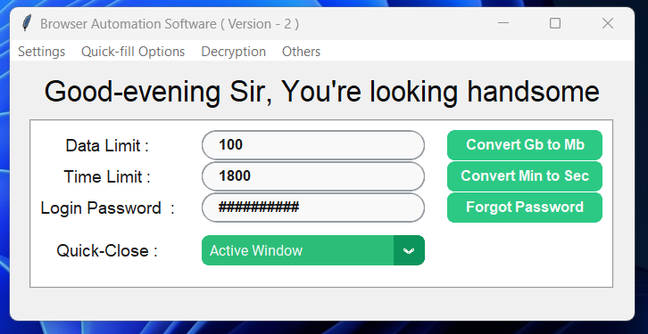
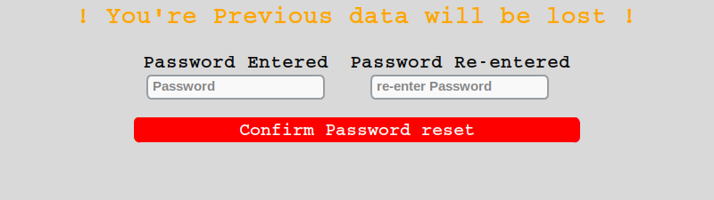
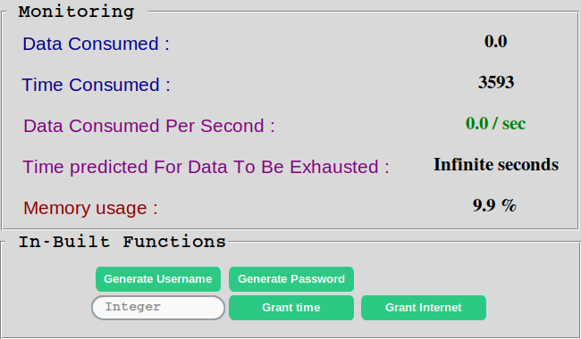
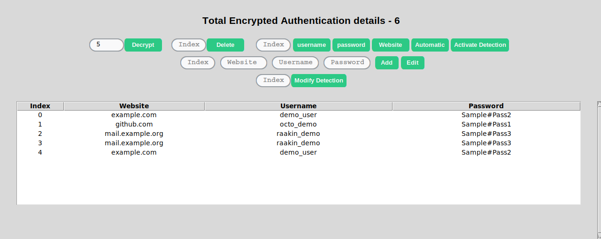
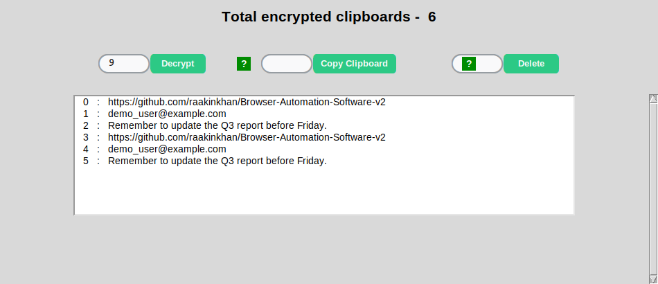
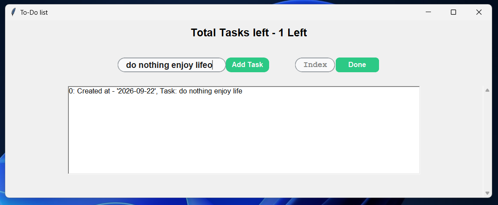
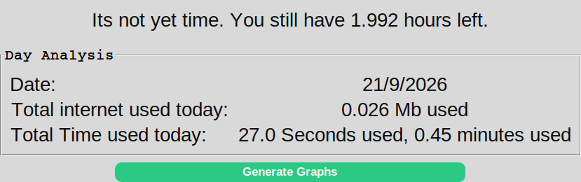
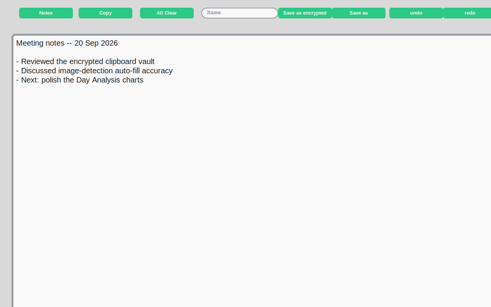
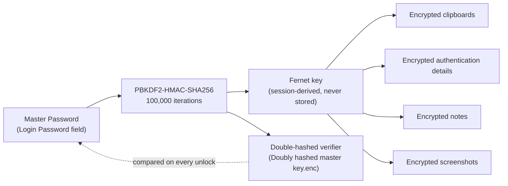

# 🧭 Browser Automation Software v2

**A single-file Python desktop "cockpit" that combines a self-imposed internet/screen-time limiter, an encrypted personal vault, and a browser-automation toolkit — all behind one master password.**


-lightgrey?logo=windows)


<p align="center">
  
</p>

> All screenshots in this README are **real captures of the running application**, taken from a live session (with placeholder/demo data — no real credentials).

---

## Table of Contents

- [What is this?](#what-is-this)
- [Feature Tour](#feature-tour)
  - [1. Control Panel & Self-Imposed Usage Limits](#1-control-panel--self-imposed-usage-limits)
  - [2. Master Password](#2-master-password)
  - [3. Live Usage Monitoring & Auto-Enforcement](#3-live-usage-monitoring--auto-enforcement)
  - [4. Encrypted Authentication Manager](#4-encrypted-authentication-manager)
  - [5. Encrypted Clipboard Vault](#5-encrypted-clipboard-vault)
  - [6. To-Do List](#6-to-do-list)
  - [7. Day Analysis & Usage History](#7-day-analysis--usage-history)
  - [8. Notes Editor](#8-notes-editor)
  - [9. Other Built-in Tools](#9-other-built-in-tools)
  - [10. Global Hotkeys](#10-global-hotkeys)
- [How It Works](#how-it-works)
- [Installation](#installation)
- [First-Time Setup](#first-time-setup-read-this-before-you-panic)
- [Menu Map](#menu-map)
- [Project / Folder Structure](#project--folder-structure)
- [Security Notes](#security-notes)
- [Known Limitations](#known-limitations)
- [License](#license)
- [Author](#author)

---

## What is this?

Most "browser automation" projects do one thing: click buttons or fill forms. This one is broader — it's built around a simple idea: **give yourself hard limits on time and data, then wrap a private, encrypted workspace around your browsing session.**

Concretely, in one Tkinter application you get:

- A **usage governor** — set a data cap and a time cap for your session; when either is hit, the app automatically closes your browser (or warns/minimizes, your choice).
- A **local encrypted vault** — clipboard history, website credentials, notes, and screenshots, all encrypted with a key derived from your master password and never sent anywhere.
- A **login auto-fill assistant** — locate username/password/website fields on screen using image recognition and auto-fill them from your encrypted vault.
- A grab-bag of **quality-of-life utilities** — a to-do list, a usage-history graph, a scratchpad notes editor, a text web-scraper, a mini scripting console, and global keyboard shortcuts for all of it.

It's a single ~3,200-line Python file (`Browser automation software.py`) — no framework, no database, just Tkinter + CustomTkinter + `cryptography` + a lot of purpose-built plumbing.

---

## Feature Tour

### 1. Control Panel & Self-Imposed Usage Limits

<p align="center">
  
</p>

The main window is where every session starts:

| Field | Purpose |
|---|---|
| **Data Limit** | Session data cap, in megabytes |
| **Time Limit** | Session time cap, in seconds |
| **Login Password** | Your master password (used to derive the encryption key for that session) |
| **Quick-Close** | What happens when a limit is hit: `Active Window` (Alt+F4), `Chrome & Edge` (Ctrl+W), `Bluestacks5` (Ctrl+Shift+X), `Only Warn`, or `Minimize` |

Two small conversion buttons (`Convert Gb to Mb`, `Convert Min to Sec`) save you the mental math when setting limits. A **Quick-Fill** menu option lets you save your usual Data/Time pair to disk and reload it instantly next time, instead of retyping it every session.

### 2. Master Password

<p align="center">
  
</p>

There's no username system — one master password unlocks (or re-encrypts) everything for that machine. It's run through **PBKDF2-HMAC-SHA256 (100,000 iterations)** to derive a Fernet key, and a *double-hashed* version of that key is stored locally purely to verify the password on future launches (the plaintext password itself is never written to disk).

Forgetting the password isn't fatal — but recovery is destructive by design: resetting it wipes the existing encrypted clipboard log, saved credentials, screen-recordings, encrypted notes, encrypted screenshots, and to-do list, since none of that data can be re-keyed without the original password. See [First-Time Setup](#first-time-setup-read-this-before-you-panic) — you'll actually need this dialog the very first time you run the app.

### 3. Live Usage Monitoring & Auto-Enforcement

<p align="center">
  
</p>

Hit **Settings → Run** and this panel opens, refreshing several times a second:

- **Data Consumed** — measured via `psutil` network counters since the session started
- **Time Consumed** — seconds elapsed / seconds remaining
- **Data Consumed Per Second** — your current burn rate
- **Time Predicted For Data To Be Exhausted** — a live projection of when you'll hit your data cap at the current rate
- **Memory Usage** — of the host machine

The same panel exposes the day-to-day utilities: **Generate Username** and **Generate Password** (both copy straight to your clipboard — the generated password is a random 20-character mix of letters, digits, and punctuation), plus **Grant Time** / **Grant Internet**, which let you top up the current session's limit on the fly without restarting.

Under the hood, a watchdog thread compares live usage against your caps every 100 ms; the instant either limit is crossed, it closes the monitoring window and fires your chosen Quick-Close action automatically — this is the actual "enforcement" behind the self-discipline concept.

### 4. Encrypted Authentication Manager

<p align="center">
  
</p>

A password manager built directly into the app (**Decryption → Authentication details**):

- Each saved login is its own encrypted file on disk (Fernet-encrypted username/password, plaintext website label), listed in a sortable table with **Index / Website / Username / Password** columns.
- **Add / Edit / Delete** by index.
- **Lazy-load** — decrypt only the N most recent entries at a time, so a large vault doesn't stall the UI.
- **username / password / Website** buttons copy the decrypted value for a given index straight to your clipboard.
- **Automatic** mode watches for your next `Ctrl+V` and injects the stored password at that moment.
- **Activate Detection / Modify Detection** — the standout feature: you can teach the app what a site's username field, password field, and "next/login" button *look like* (small cropped screenshots, stored under `Images for Detection/`), and it will locate them on screen with `pyautogui.locateOnScreen` and click + type into them automatically. This is what lets the `U` / `P` / `W` hotkeys (below) auto-fill a login form without any site-specific scripting.

> The credential table above shows placeholder demo entries (`octo_demo`, `demo_user`, etc.) generated for this README — not real accounts.

### 5. Encrypted Clipboard Vault

<p align="center">
  
</p>

Press the **Q** hotkey anywhere on your system and whatever is currently on your clipboard is Fernet-encrypted and appended to a local log. **Decryption → Copied Text** brings up this viewer, where you can:

- Decrypt and browse the last N entries (lazy-load, same as the credential manager)
- **Copy Clipboard** — restore any past entry back onto your clipboard by index
- **Delete** a single entry or a whole index range at once

It's effectively an encrypted, searchable clipboard history — handy for pulling back something you copied over hours ago without it ever sitting in your OS's plaintext clipboard manager.

### 6. To-Do List

<p align="center">
  
</p>

A minimal task list (**Others → To-Do list**): type a task, hit **Add Task**, and it's stored as its own file with a creation timestamp. Mark a task **Done** by index to remove it. No projects, tags, or due dates — just a fast scratch list that lives alongside everything else.

### 7. Day Analysis & Usage History

<p align="center">
  
</p>

**Others → Day Analysis** rolls up everything the monitoring panel measured that day — total data and total time used — and includes a light "wellbeing" nudge (a short message about whether you're inside or over your usual daily allowance). A **Generate Graphs** button hands the day-over-day history to `matplotlib` for a plotted view of your usage trend over time.

### 8. Notes Editor

<p align="center">
  
</p>

**Decryption → TakeNotes** opens a full-width rich text scratchpad with **undo/redo**, **Copy**, **All Clear**, and two save paths: **Save as** (plain `.txt`, under `All text files from TakeNote/`) or **Save as encrypted** (Fernet-encrypted, under the vault). A companion **Notes** button lets you reopen anything you've saved previously.

### 9. Other Built-in Tools

A few more corners of the app worth knowing about, even though they're not pictured above:

- **Encrypted Screenshot Gallery** (*Decryption → Images*) — every screenshot you capture with the **\*** hotkey is compressed, Fernet-encrypted, and stored. A full gallery viewer lets you page through, jump to an index, view a random one, group images into named folders, delete, or export a decrypted copy back to disk.
- **Visual Descriptive Writing** — pairs a block of written text with an image set, for annotating screenshot collections.
- **Text Web Scraper** (*Others → Text webscrapper*) — fetches a URL with `requests` + `BeautifulSoup` and pulls out the readable text.
- **Mini "IDLE" Console** (*Others → IDLE*) — a small custom scripting console built on top of the app's own hand-rolled tokenizer/interpreter, for quick one-off calculations without leaving the app.
- **Quick-Copy field** — a persistent one-line field on the main window for a snippet you paste constantly (an email address, a signature, etc.) — one click copies it.

### 10. Global Hotkeys

Once you've clicked **Settings → Run**, these work system-wide (not just while the app is focused):

| Key | Action |
|---|---|
| `Tab` | Quick-close (per your Quick-Close dropdown choice) |
| `Q` | Capture & encrypt current clipboard contents |
| `O` | Mark the top-left corner for the next screenshot region |
| `*` | Capture, compress, and encrypt a screenshot |
| `U` | Locate the on-screen **username** field (image detection) and type the saved username |
| `P` | Locate the on-screen **password** field and type the saved password |
| `W` | Locate the on-screen **website/login** field and act on it |
| `` ` `` | Deactivate image-detection auto-fill |

---

## How It Works



- **No database** — every clipboard entry, saved login, note, and screenshot is its own small file (mostly `pickle`), organized into purpose-named folders that the app creates automatically on first launch.
- **Nothing leaves your machine** — encryption, storage, and image-detection all run locally. The only outbound network call in the whole codebase is the optional text web-scraper, which only fires when you explicitly give it a URL.
- **The key is never persisted** — it's re-derived from your typed password each time you interact with an encrypted feature, so if the app closes, the key is gone from memory with it.

---

## Installation

**Requirements:** Python 3.10+ on **Windows** (recommended — the Quick-Close hotkeys use Windows-style key combos like `Alt+F4` and `Win+M`, and the `keyboard` library's global hooks need elevated privileges on Linux/macOS). The app checks your CPU core count on launch and will warn (but still run) if you have fewer than 3 cores.

```bash
git clone https://github.com/raakinkhan/Browser-Automation-Software-v2-GIT-Friendly-.git
cd Browser-Automation-Software-v2-GIT-Friendly-
pip install -r requirements.txt
python "Browser automation software.py"
```

On first run the app auto-creates every folder it needs (`Encrypted screenshots`, `Encrypted written notes`, `To-do list folder`, etc.) — you don't need to create anything by hand.

> Global hotkeys and the `Ctrl+V` auto-fill listener use the `keyboard` package, which typically needs to be **run as Administrator on Windows** (or with root on Linux) to see key events outside the app's own window.

---

## First-Time Setup — read this before you panic

This repository ships with a `Doubly hashed master key.enc` file that already contains a hash — it's tied to a password only the original author knows. **You will not be able to log in with any password on a fresh clone.** That's expected. To set your own password:

1. Launch the app.
2. Click **Forgot Password** (or **Settings → Change Password**).
3. Enter and re-enter a new password in the dialog shown above.
4. Click **Confirm Password reset**.

The app will close itself after this (by design — see [Security Notes](#security-notes)). Relaunch it and log in with your new password from then on.

---

## Menu Map

| Menu | Contains |
|---|---|
| **Settings** | Run, Reset the Entry Fields, Change Password |
| **Quick-fill Options** | Quick-Fill, Overwrite Quick-Fill |
| **Decryption** | Copied Text, Images, Authentication details, TakeNotes, Visual descriptive writing |
| **Others** | Day Analysis, To-Do list, Text webscrapper, IDLE |

---

## Project / Folder Structure

```
Browser-Automation-Software-v2-GIT-Friendly-/
├── Browser automation software.py        # the entire application
├── requirements.txt
├── Doubly hashed master key.enc          # password verifier (see First-Time Setup)
├── Images for Detection/
│   ├── username images/                  # field templates used by image-detection auto-fill
│   └── password images/
├── Browser automation software stored encrypted files/
│   ├── encrypted clipboards/
│   ├── Encrypted Authentication Details/
│   ├── Encrypted written notes/
│   ├── Encrypted screenshots/
│   ├── Encrypted screenrecords/
│   └── Encrypted Visual descriptive writing/
├── Browser automation important cache files/
│   ├── image instead of video cache data/
│   └── modification image detection list details/
├── All text files from TakeNote/         # plain (unencrypted) saved notes
├── Folder Holding Files/                 # screenshot-gallery folder groupings
└── To-do list folder/
```

---

## Security Notes

- **Key derivation:** PBKDF2-HMAC-SHA256, 100,000 iterations, producing a 32-byte key for Fernet (AES-128-CBC + HMAC) encryption.
- **Static salt:** the PBKDF2 salt is a fixed string hard-coded in the source rather than a per-install random value. This is a meaningful weakness if you're evaluating this for anything beyond personal, local use — it means precomputed attacks are more feasible than with a random salt.
- **Plaintext display:** the Authentication Manager's table shows decrypted usernames/passwords directly in plain text (not masked), so treat that window like an open password manager — don't leave it up on a screen-share.
- **Password reset is destructive, on purpose:** because the encryption key is derived from your password and never stored, there's no way to re-key old data after a reset — the app clears it instead of leaving orphaned, permanently-undecryptable files behind.
- **Fully local:** aside from the optional web-scraper feature, no data this app manages is ever transmitted anywhere.

---

## Known Limitations

- **Windows-first.** Several conveniences (Quick-Close key combos, reliable global hotkeys) assume a Windows environment.
- **Screen-size assumptions.** A few windows (the notes editor, the web scraper) size an inner text area to your full detected screen resolution rather than a fixed size, which can look oversized on unusual display configurations.
- **Image-detection auto-fill is template-based**, not OCR — it looks for a pixel-for-pixel match of a previously captured field image, so it's sensitive to zoom level, theme, and page layout changes on the target site.
- **Single global master password** — there's no per-item or per-site password, and no multi-user support.
- **This is a personal/hobby project**, not an audited security product — see [Security Notes](#security-notes) above before relying on it for anything sensitive.

---

## License

The [`LICENSE`](./LICENSE) file in this repository states:

> Copyrights @ 2026 Raakin Khan. All rights reserved. No permission is granted to use, modify, distribute, reproduce, or create derivative/similar concept works from this software without prior permission.

**This project is not under the MIT License.** If you intend to license it permissively (e.g., MIT), update the `LICENSE` file and any badges/documentation accordingly — until then, treat it as All Rights Reserved.

---

## Author

Made by **Raakin Khan**.
